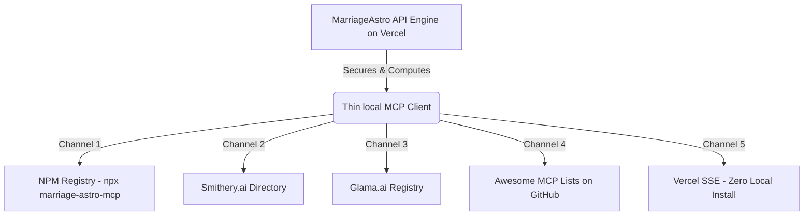

# 🚀 Model Context Protocol (MCP) Distribution & Go-To-Market (GTM) Strategy
## MarriageAstro — The Premium Vedic Astrology Engine

This document outlines our distribution and developer growth strategy for the **MarriageAstro MCP Server**. Because our server is uniquely thin (a fast HTTP proxy linking local AI clients to our optimized Swiss Ephemeris WASM engine on Vercel), we have a massive unfair advantage in portability, speed, and cross-platform compatibility.

---

## 💎 The Technical Advantage: Thin-Client Architecture

Most complex MCP servers suffer from packaging fatigue: they require native C++ binaries, local WebAssembly loaders, or massive node_modules footprints that fail across different OS platforms (Windows vs. macOS).

Our MCP server (`marriage-astro-mcp`) resolves this perfectly:
* **Zero Native Bloat:** All Swiss Ephemeris and astronomical computations run securely in our highly optimized Vercel Serverless environment.
* **Pure Proxy Client:** The local MCP package simply parses AI schema inputs using Zod, sends a lightweight HTTP request to `https://marriage-astro.vercel.app/api/v1`, and returns the results.
* **Instant Portability:** It runs flawlessly on any machine running Node >= 18 with absolute consistency.

---

## 🗺️ Distribution & GTM Channels



### 1. The Developer Entrypoint: NPM Registry
* **Goal:** Enable instant local execution without global installation.
* **Mechanism:** Publish the `marriage-astro-mcp` package to NPM.
* **User Experience:** Developers can add the tool to Claude Desktop, Cursor, or Windsurf instantly using:
  ```json
  "command": "npx",
  "args": ["marriage-astro-mcp"]
  ```

### 2. The Direct-to-Claude Directory: Smithery.ai
* **Goal:** Capture the largest dedicated directory of MCP users.
* **Mechanism:** We built and compiled a strictly validated v0.3 `manifest.json` along with a highly optimized production bundle `marriage-astro-mcp.mcpb` (cleaned down to 3.34 MB from 12.4 MB). Pushed to GitHub and ready for live listing.
* **User Experience:** Users can click a single install button. Smithery installs the sandboxed `.mcpb` bundle locally on the user's host machine, prompts securely for the `MARRIAGE_ASTRO_API_KEY`, and configures their Claude Desktop configuration instantly without any manual setup!

### 3. The Interactive Sandbox: Glama.ai Registry
* **Goal:** Allow users to test the Vedic astrology tools in their web browser before installing them locally.
* **Mechanism:** Register on Glama MCP Registry.
* **User Experience:** Glama provides a live interactive playground. Users enter their birth details to see how the LLM translates raw Ashtakoot and Synastry JSON outputs into rich visual readings.

### 4. Direct IDE Integrations (Cursor, Windsurf, Cline)
* **Goal:** Capture active AI-native software developers who use AI as their main daily assistant.
* **Mechanism:** Document standard configurations in our repository README and write dedicated medium/dev.to articles demonstrating: *"How to let your IDE plan your wedding or analyze compatibility using Vedic Astrology."*

### 5. 🚀 The Secret Weapon: Vercel Server Sent Events (SSE)
* **Goal:** Eliminate the local Node requirement entirely.
* **Mechanism:** Vercel supports HTTP-based MCP servers over Server Sent Events (SSE). We can implement a direct `api/mcp` endpoint in our web app.
* **User Experience:** Instead of configuring local `npx` commands, users simply paste a URL into Cursor or Claude:
  `https://marriage-astro.vercel.app/api/mcp?key=your-api-key`
  This makes distribution as simple as pasting a link, which is a massive competitive advantage!

---

## 📈 Execution & Go-To-Market Plan

### Phase 1: Registry Deployment (Week 1)
1. **NPM Publish:** Run `npm publish --access public` inside the `mcp-server` folder to claim the `marriage-astro-mcp` name on the official registry.
2. **Smithery Submission:** Push the repo and trigger the Smithery web crawler at `https://smithery.ai/new` to parse `smithery.yaml`.
3. **Glama Registration:** Submit the published NPM package to the Glama registry.

### Phase 2: Community Outreach (Week 2)
1. **Launch on Product Hunt:** Frame it as: *"The world's first AI-native relationship coach powered by Vedic Astrology and MCP."*
2. **Showcase on r/LocalLLaMA:** Demonstrate how open-source LLMs can suddenly perform premium calculations (divorce risk, timeline stress, attachment styles) when bridged with a specialized astrology engine.
3. **Submit to Awesome Lists:** Propose pull requests to punkpeye's `awesome-mcp-servers` and modelcontextprotocol's official repository under the "Lifestyle / Data Services" category.

### Phase 3: Claude Native Connector Directory Integration (Week 3)
1. **Implement OAuth 2.0 Flow:** Anthropic's public connector catalog requires standard **OAuth 2.0** verification so users can authorize the connector without copy-pasting API keys manually. We must implement standard OAuth handshakes on `marriage-astro.vercel.app`.
2. **Submit to the Claude Directory:** 
   * Anthropic features custom connectors to the general public via a curated submission pipeline. 
   * Submit the production Vercel server URL (`https://marriage-astro.vercel.app/api/mcp`), detailed metadata, security posture, and icons through the developer console submission form at `platform.claude.com/plugins/submit` (or email the Anthropic review team at `mcp-review@anthropic.com`).
3. **Accumulate Traction & Review:** Once listed, your connector appears inside the official Claude Connector Registry, allowing millions of users to activate it instantly in one click!

### Phase 4: B2B Expansion (Week 4+)
1. **Dating & Matrimony Platform APIs:** Reach out to modern niche dating platforms (e.g., culturally focused apps) offering them the ability to integrate live Ashtakoot matching or premium Synastry reports directly into their chat interfaces using our Developer Tier.

---

> [!TIP]
> **Remind Users of our Free-to-Premium Funnel:** 
> Our MCP server implements a beautiful "Preview-First" mechanism. Even on the free tier, when a user queries a premium endpoint (like `get_divorce_risk`), they receive a genuine, birth-chart-specific summary preview containing real calculations, accompanied by a clean upgrade link (`https://marriage-astro.vercel.app/api-keys`). This drives high conversion rates directly from the user's terminal or AI client!
