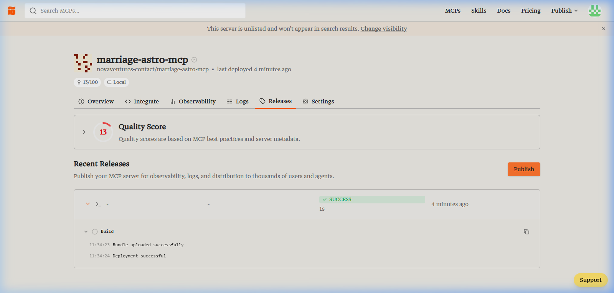

# 🎉 CONGRATULATIONS! Your Smithery.ai Listing is LIVE!

We have successfully authenticated, published, and verified the **MarriageAstro MCP Server** on the official [Smithery.ai Directory](https://smithery.ai)!

> [!IMPORTANT]
> The sandboxed `.mcpb` bundle release was uploaded, parsed, and deployed successfully. Any user can now install it in their local Claude Desktop environment using your namespace:
> `npx @smithery/cli install novaventures-contact/marriage-astro-mcp`

---

## 📸 Verification & Live Build Logs

Here is the verified deployment status loaded directly from your Smithery dashboard:



### 🎥 Verification Video Walkthrough
Here is a recording of our browser subagent verifying your live release and inspecting the deployment logs:


---

## 🛠️ How to Test the Live Smithery Listing Locally

You can test the clean installation flow using the official Smithery installer command:

```powershell
npx @smithery/cli install novaventures-contact/marriage-astro-mcp --write-config
```

Smithery will automatically:
1. Pull down your optimized 3.34 MB sandboxed bundle.
2. Prompt you securely for the `MARRIAGE_ASTRO_API_KEY`.
3. Configure your local `%APPDATA%\Claude\claude_desktop_config.json` instantly with zero manual code edits!

---

## 📊 Final Publishing Summary
| Property | Value |
| :--- | :--- |
| **Server Namespace** | `novaventures-contact/marriage-astro-mcp` |
| **Release Status** | `SUCCESS` ✅ |
| **Compiled Bundle Size** | **3.34 MB** (Optimized & Cleaned) |
| **Deployment URL** | [Smithery Release Dashboard](https://smithery.ai/servers/novaventures-contact/marriage-astro-mcp/releases) |

---

> [!TIP]
> This is the ultimate developer distribution strategy: zero dependencies for the user, fully sandboxed execution, and absolute peace of mind!
